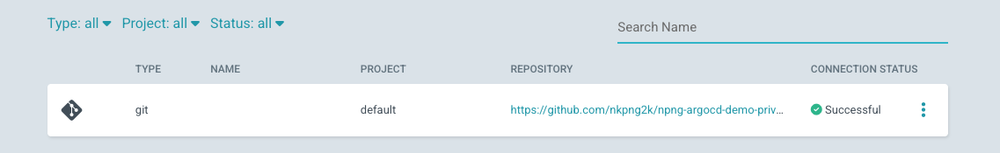
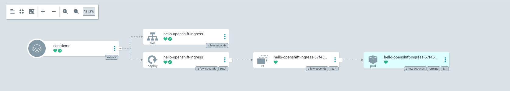

# ArgoCD Short-Lived Token Demo

This is a simple demo that showcases how to deploy an ArgoCD Application
using short-lived tokens generated by the External Secrets Operator.

This demo requires you to have created and installed a GitHub App
configured to interact with a Private repository

## Prerequisites

Must have the following installed:
- `oc`
- `helm`

Must have admin credentials for an OpenShift cluster and be logged in via:
`oc login ...`

Must have an `App ID` and `Installation ID` from GitHub after properly
configuring your repository with your created GitHub App.

## Steps

1. Make sure to have `oc` and `helm` installed
2. Make sure to follow the steps detailed in GitHub to create a GitHub App
and install it. Copy down the App ID and Install ID. 
  * NOTE: for personal GitHub Apps, you can find the App ID in the developer settings of your profile
  * NOTE: for personal GitHub Apps, you can find the Install ID in the URL
  of the Applications settings of your profile after clicking `Configure`.
3. Make sure to log in with your admin credentials via `oc login` command
4. You can make edits to the `variables.sh` file if you want to configure
where to point the demo to for some things.
5. Run the scripts in order from the `src` folder:
```sh
# Installs the external secrets manager (Vault) and External Secret Operator
./01_install.sh

# Configures the running Vault with some dummy values and enables Kubernetes auth
./02_setup_secrets_with_vault.sh

# Configures the necessary ESO resources including the token Generator
# See validation steps below
./03_setup_eso_resources.sh

# Deploys a sample application with ArgoCD
# See validation steps below
./04_deploy_argo_app.sh

# Cleanup step. Tearsdown the resources created during the prior steps
./05_cleanup.sh
```
6. Validate successful deployment. If the above steps were successful,
you would be able to go to the ArgoCD UI console and see a healthy linked
repository:

Under `Settings/Repositories`:


Under `Applications`:


Additionally, you can push a new commit to your private repo. ArgoCD
should be able to identify this change and update the deployed
Application accordingly. 

## Disclaimer

This is not guaranteed to work in all environments, and is meant to showcase an example of how external secrets operator can consume secrets from an external secret manager.
