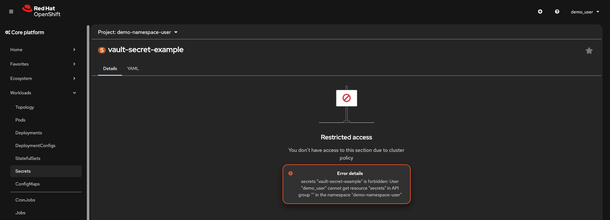
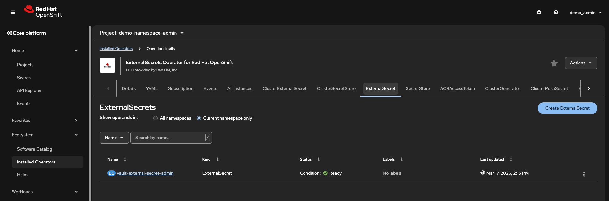
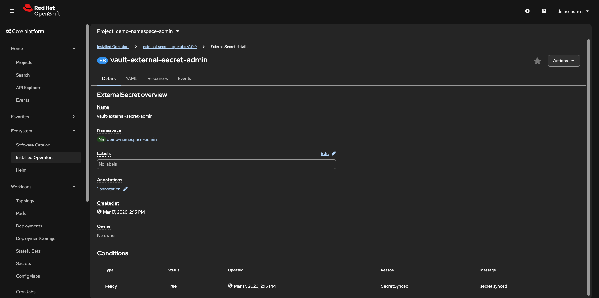

# Using ESO to minimize visibility of Kubernetes Secrets

*DISCLAIMER* this demo is intended to be run on a barebones/clean
cluster. If you are using a pre-existing OpenShift cluster,
*DO NOT* run script `02_setup_users.sh`. You should use the
example role bindings and attach those to users created based on
the pre-existing OAuth solution setup for your OpenShift cluster.

We recommend using something like Keycloak or another OIDC provider
rather than htpasswd, but htpasswd suffices for this specific demo.

## Background/Context

This demo is designed to showcase how you can use Kubernetes RBAC rules
plus the External Secrets Operator to minimize the exposure of users
to Kubernetes Secrets. The reason for this is:
* Many companies are not permitted to allow their developers to see/read
Kubernetes Secrets. This is because these Secrets contain base64 encoded
text of the credentials they house. 

The use of the Kubernetes Secret is commonplace and widely used by _most_
software products built for Kubernetes. So, this is where secrets management
tools can become useful. While the "security" or lack thereof of a Kubernetes
Secret is hotly debated to this day. This demo shows a method by which _some_
of these security concerns can be mitigated by abstracting away the need
to visibly inspect Kubernetes Secrets. Using a tool like the External
Secrets Operator allows DevSecOps teams to inspect just the higher order
ESO CRD and still have the useful information needed to debug a workload
while not being permitted to actually inspect the underlying Kubernetes
Secret.

**Important Note:** Even the Kubernetes `list` verb returns the full Secret
object data, including base64-encoded values. This means `oc get secrets -o yaml`
exposes all secret content even without the `get` verb. Therefore, this demo
removes **all** Secret access from user roles rather than attempting to grant
limited access. Kubernetes Events are granted instead, providing diagnostic
information (e.g., mount failures, sync errors) without exposing secret values.

## Prerequisites

Must have the following installed
- `oc`
- `helm`
- (OPTIONAL) `htpasswd` - you only need this if you want to generate
temporary users for the demo.

Must have admin credentials for an OpenShift cluster and be logged in via:
`oc login ...`

*Must be able to create or have already created 2 users:* `demo_admin` and `demo_user`

## Steps

1. Make sure to have `oc` and `helm` installed. Optionally, ensure `htpasswd` is installed
2. Make sure to log in with your admin credentials via `oc login` command
3. Make sure you are permitted to create two users in OpenShift: `demo_admin` and `demo_user` via `htpasswd`. Alternatively, ensure that these two users already exist.
    - Note: The demo users can be removed after the demo is complete.
4. Run the scripts in order from the `src` folder
```sh
# Installs the external secrets manager (Vault) and External Secret Operator
# Also creates two demo namespaces
./01_install.sh

# (OPTIONAL) Script used to create the two demo users. This can be skipped
# if the demo users already exist
# use the -h flag to see all possible options
./02_create_users.sh -h

# Configures the two users with necessary roles and role bindings
./03_configure_users.sh

# Deploys the necessary External Secrets Operator CRDs to test access with
./04_deploy_eso_crds.sh

# Validates that neither user has ANY access to Kubernetes Secrets, and that
# only the `demo_admin` user can access the ESO CRDs for debugging
./05_validate_admin_permissions.sh
./06_validate_user_permissions.sh

# Cleanup step. Tearsdown the resources created during the prior steps.
./07_cleanup.sh
```

## Validation

You can run the `./05_validate_admin_permissions.sh` and 
`./06_validate_user_permissions.sh` shell script to validate access
via CLI, but you should also validate the ability to view the Secrets and CRDs
via the OpenShift Console. To do this:
1. Log into the OpenShift Console with the appropriate user credentials
2. Select the `Workloads` tab on the left-hand tool bar
3. Select the `Secrets` option in the `Workloads` dropdown menu
  - Verify that the user CANNOT see any secrets (should see a permissions error)
  
4. As the `demo_admin` user, select the `Ecosystem` tab and select `Installed Operators`. You might need to select a specific project first.
  - Verify that you can see the installed External Secrets Operator
  - Verify that you can see a list of deployed `ExternalSecrets` in the selected project only
  
  - Verify that you can click on the deployed `ExternalSecret` and see its information
  

## Disclaimer

This is a *DEMO* and performs some actions that are *NOT* recommended in a production
environment. Please be careful when running the scripts in this directory. This demo
is specifically intended to highlight how to configure RBAC roles and rolebindings
to limit user visibility of Kubernetes Secrets.

This is not guaranteed to work in all environments, and is only meant to showcase an example of how external secrets operator can consume secrets from an external secret manager in order to help minimize user visibility of Kubernetes Secrets.
